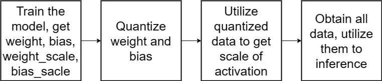

# Lab2

## Introduction

In this lab, we need to complete QAT and PTQ on Multilayer Perceptron(MLP) Nerual Network(NN). Firstly train the model with the added Fake-quantization layer, and then save the model's weights, biases, and their corresponding scaleing factor into .npy file. Next,quantize weights and biases by these scaling factors, load quantized data into a model without fake-quantization layer to obtain the sacling factor of activation. Finally, we can obtained the quantized weights, quantized biases and activation scaling factor. We can load this data into a standard MLP model for inference.


We have provided a  code framework. You need to complete the "______" part according to our hints.


## Post-training quantization (PTQ)
PTQ is a significant optimization technique in the realm of deep learning.
During the training process, weight and bias information in all layers is typically stored in high-precision formats, like floating-point. 
We can store these data in training process. After training, PTQ directly process these floating-point data and quantize it into lower bits, like 8-bit.
The implementation of PTQ is simple, while the accuracy reduction introduced by quantizatiopn process is 
generally acceptable.

PTQ quantization formula (unsigned):


 $$X = \hat X \approx S_x(x_{int}) = clamp[ round(\frac{x}{S_x}); 0, 2^{BW}-1 ] $$
## Quantization-Aware Training (QAT)
PTQ is straightforward to implement and doesn't require the extensive retraining，but it has limitations when aiming for low-bit quantization (e.g. 4-bit).

QAT is a technique used in deep neural networks (DNNs) to optimize models for reduced computational and memory requirements, making them suitable for resource-constrained embedded devices and faster inference. This approach involves converting the floating-point weights and activations of a neural network into lower-bit-width fixed-point or integer representations.


Compared with PTQ, QAT considers the quantization process during the training phase, resulting in higher accuracy. Specifically, it quantizes the origin inputs into low-bit data and dequantizes the data. Through this operation, the final 'real' inputs may differ from the origin one beacuse it considers quantization errors. We called this operation *FakeQuantization* .

We can simply think of this operation as fellow:

QAT's forward process:

$$X = \hat X \approx S_x(x_{int}) = S_x*{clamp[ round(\frac{x}{S_x}); -2^{BW-1} , 2^{BW-1}-1 ] }$$


$S_{x}$ means the scaling factor of quantization, $S_x = \frac{Val}{QuantVal}$. clamp($-2^{BW-1}$, $2^{BW-1}-1$) makes sure the range after quantization.

QAT's backward process:
<p align="center">
  

The black line is our approximate value, the red line is real value. We can approximate that the gradient is 1 in the backward process if the quantized value is in the right range.

$$\frac{\partial \hat X}{\partial x} = \begin{cases} 1, if \ 0 \leq x_{int} \leq 2^{BW}-1 \\
0,otherwise\end{cases} $$


this means if $x_{int}$ is in the range, we can let *FakeQuant* module's gradient 1, otherwise we let gradient 0.

Here we show a simplified figure to show the flow of data:
<p align="center">
  

black line means forward process and red line means backward process

## Lab Procedure
1, Utilize the `FakeQuant` layer and the `FullyConnectedLayer` to train the model. This process will generate data, including weights, biases, and their corresponding scales.

2, Process the stored data to obtain quantized data, which can be achieved because we have access to the quantization scales.

3, Load the quantized data into the MLP for inference. At this stage, there is no need to update the weights and biases; our focus is solely on determining the activation scaling. Save the scale of activation and the quantized data.

4,Finally, load the entire dataset into a standard MLP and complete the lab.


<p align="center">
  


## Lab Requirement
In the Quantmodel, you need to complete the Quant.py file, which includes the *FakeQuant* and *FullyConnectedLayer* modules.

If you have the *mlp-128-128-5-epoch.npy* and *loss.npy* files in the Data folder, you can proceed to finish the "______" in the main.ipynb file. Run the code sequentially.
## Lab Assignment

```
git clone
```

This lab only needs *numpy* , we can

```
pip numpy -i https://pypi.tuna.tsinghua.edu.cn/simple
pip matplotlib -i https://pypi.tuna.tsinghua.edu.cn/simple
pip install jupyter -i https://pypi.tuna.tsinghua.edu.cn/simple
```
if you use Vscode, you can add *Jupyter* in extend function (Ctrl+Shift+x)

If we want to run the result

```
run code in main.ipynb file
```

## Directory

```
|-- Data                  # save .npy file
|-- README.md             # Readme file
|-- mnist_data            # Mnist datasets
|-- Quantmodel            # Folder of main lab
`-- mnist_mlp_cpu.py      # File contains NN struct and training
`-- Quant.py              # File contains layer definition
|-- main.ipynb           # Final file that need to be run 
```
1. `Data` is the data we saved in .npy file.
2. `README.md` is the lab's description document.
3. `mnist_data` is the dataset we need in this lab.
4. `mnist_mlp_cpu.py` is our target file. We need to complete the model structure , its forward and backward part.
5. `Quant.py` is our target file. We need to complete the *FullyConnectedLayer*, *ReLULayer* , *SoftmaxLossLayer* and *FakeQuant* modules.
6. `main.ipynb` is file we run to see the lab's result.

## Submission
Please compress all the file into a `zip` file with name {StudentNumber_StudentName}_EE219_Lab1_2.zip, and submit to Blackboard. The file structure should be like this.
```
12345678_张三_EE219_Lab1_2.zip
|-- Data                  # save .npy file
|-- mnist_data            # Mnist datasets
|-- Quantmodel            # Folder of main lab
`-- mnist_mlp_cpu.py      # File contains NN struct and training
`-- Quant.py              # File contains layer definition
|-- main.ipynb           # Final file that need to be run 
```
## Reference
[1] Siting,Liu EE219: AI Computing Systems, ShanghaiTech University, 2023
