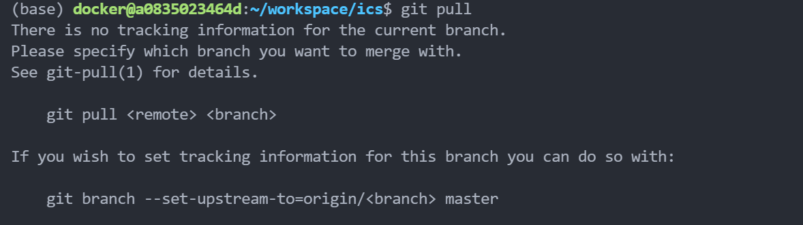

# AI Computing Systems

## Introduction

This repository is the experimental environment for the cource `AI Computing Systems` of ShanghaiTech University.

This experimental environment is developed based on the project `oscpu-framework` of [OSCPU](https://github.com/OSCPU).

## Get started

First, prepare the softwares following the instruction.

[Preparation for softwares](./doc/tutorial/manual-1.md)

Second, config the experimental environment and learn the basic usage.

[Instructions for usage](./doc/tutorial/manual-2.md)

If you want to learn about the compiling script, you can read the introduction.

[Introduction of the Compiling Script](./doc/tutorial/manual-3.md)

## Lab Assignment

**Note!!!**

This repository  in the docker image is the initial version. Experimental content of the labs will be released successively in this repository. So you need to use the following git command to update your local repository once new lab is released.

```
git pull
```

If you have trouble in executing `git pull` like this situation, you can try the command below before executing `git pull`.



```bash
git branch --set-upstream-to=origin/master master
```

## Directory

```
|-- README.md             # Readme file
|-- build.sh              # Build script file
|-- myinfo.txt            # User information file
|-- bin                   # Folder of machine binary files
|-- doc                   # Folder of documents
|-- libraries             # Folder of necessary libraries
|-- projects              # Folder of main projects
`-- tools                 # Folder of some useful tools
```

1. `README.md` is the project's description document.
2. The `build.sh` is a verilator compilation script that greatly simplifies the compilation of vialtor. At the same time, this script can record the user's compilation history to avoid faking. **Note: Modification of this script is forbidden!!!**
3. The `myinfo.txt` records the user's personal information, which should be updated in this file first after entering the environment for the first time. The compile script records this information when it records the user's compile history. If personal information is written, the compile script will not work.
4. The directory `bin`, holds some machine code that will be used in the cpu emulation.
5. The directory `doc`,  holds the relevant documentation and some manuals about RISC-V.
6. The directory `libraries`, holds the necessary library files that will be used in the cpu emulation.
7. The directory `projects`, holds the user's custom project code.
8. The directory `tools`, holds some useful scripts or tools.
