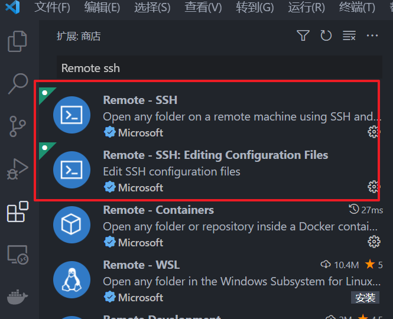
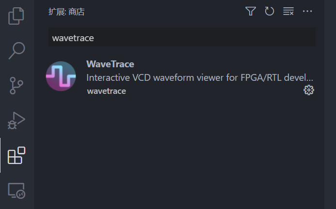
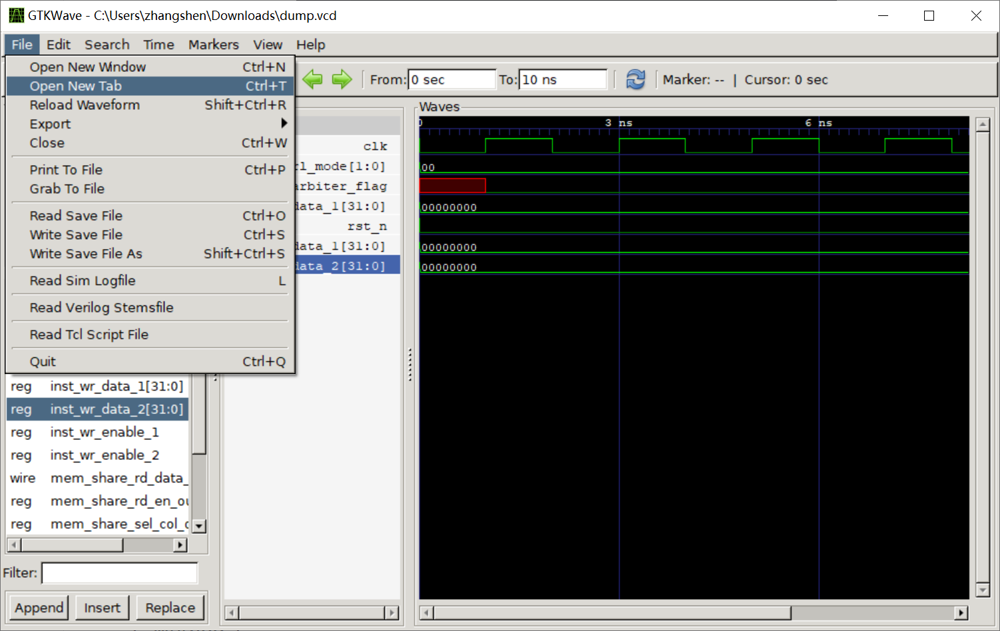

# Preparation for Softwares

## Docker

The download website for docker: [Get Started with Docker | Docker](https://www.docker.com/get-started) .

Docker is supported in Windows, Linux and MacOS. The detailed installation process can be found in the following links.

| OS      | Link                                                                                                                 |
| ------- | -------------------------------------------------------------------------------------------------------------------- |
| Windows | [https://www.runoob.com/docker/windows-docker-install.html](https://www.runoob.com/docker/macos-docker-install.html) |
| Ubuntu  | [https://www.runoob.com/docker/ubuntu-docker-install.html](https://www.runoob.com/docker/macos-docker-install.html)  |
| MacOS   | [https://www.runoob.com/docker/macos-docker-install.html](https://www.runoob.com/docker/macos-docker-install.html)   |

Note: For Win10 users, if you failed to install WSL2 or Hyper-V, you may try to install docker with VirtualBox. If you have ever installed VMWare or VirtualBox, I recommend that you'd better install docker with VirtualBox since there are some conflicts between Hyper-V and them.

## VS-Code

The download website for vscode: [Visual Studio Code - Code Editing. Redefined](https://code.visualstudio.com/) .

The installation will be easy. And after that, some extensions for VS-Code are recommend to be installed.

### Remote-SSH

The Remote-SSH extension plugin can help users connect to linux servers via ssh. With the help of this plugin, users can directly edit the file resources of the linux servers,  call linux terminals.

<div align=center>

</div>

### WaveTrace

WaveTrace is a plugin for viewing waveforms in vscdoe, which can easily view vcd waveforms directly from remote servers. However, the plugin only supports up to 8 waveforms at the same time in normal mode. If you want to view more, you need to purchase a license (15 USD for 2 devices).

<div align=center>

</div>

### Others

There are some other extentions that are recommended:

* Docker
* One Dark Pro
* Prettier - Code formatter
* Verilog Format
* Office Viewer
* Bracket Pair Colorizer 2
* Chinese Language Pack

## GTKWAVE

The download website for gtkwave: [GTKWave (sourceforge.net)](http://gtkwave.sourceforge.net/) .

The user manul can be get here, [http://gtkwave.sourceforge.net/gtkwave.pdf](http://gtkwave.sourceforge.net/gtkwave.pdf).

Simple usage example:

1. Method-1

After setting the path, you can use the command to view the vcd waveform.

```
gtkwave wave.vcd
```

2. Method-2

You can also use the GUI window to view vcd waveform.

<div align=center>

</div>
