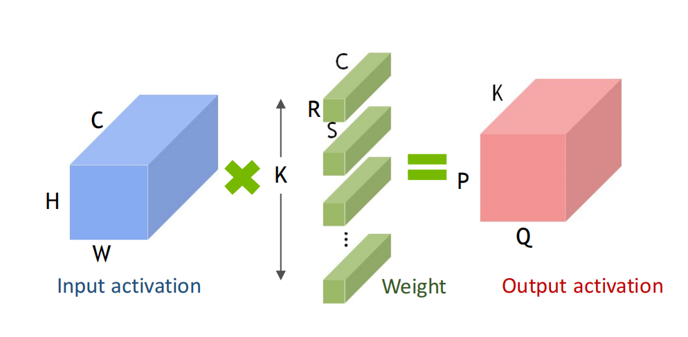

# Lab3: 

## Introduction
This lab aims to design a matrix multiplication module, and apply it to 2D convolution. The diagram of the system design is shown below. Your job is to fill pe.v and vector_mac.v in `lab3/vsrc/src` folder.

The inputs of the system is the input activation and weights (convolution kernels). 
<p align="center">
  
</p>
<p align = "center">
  <i>2D convolution</i>
</p>

In this lab, you need to implement the PE, and VECTOR MAC module by yourself.

<p align="center">
  
</p>
<p align = "center">
  <i>System Top Diagram</i>
</p>

### im2col
Im2col is not required for this lab. The input of this lab has been processed by im2col, so the following is only for introduction.
When performing a 2D convolution, the data in the convolution window is stored discontinously in memory, which is not efficient for computation. The im2col operation is to **reshape the input activations and the weights into matrices X and W, so that the convolution operation is converted to a matrix multiplication**. After im2col, the operation of 2D convolution is equivalent to the mutiplication of matrix W and matrix X. The size of matrix W and matrix X is **K \* N** and **N \* M**, where K is the number of convolution kernels, N is the number of weights in a kernel and M is the number of the output activations.

<p align="center">
  
</p>
<p align = "center">
  <i>im2col operation  </i>
</p>

Similarly，when channel > 1，the size of matrix W and matrix X is **K \* (N \* C)** and **(N \* C) \* M**, where K is the number of convolution kernels, N is the number of weights in a kernel , M is the number of the output activations, and C is the number of channels.


### Data Storage

All the data are 24-bit width. The upper 16 bits of input and weight are 0. They are stored in a simulated memory component in verilog.
>Important Notice: the weights are stored in **row-major**, the input after im2col and output matrix are stored in **column-major**. In addition, the arrangement of weights in higher dimensions is shown below.

<p align="center">
  
</p>
<p align = "center">
  <i>Row-major & Column-major</i>
</p>
<p align="center">
  
</p>
<p align = "center">
  <i>weight storage</i>
</p>


| Name | Value | Description |
| - | - | - |
| IMG_BASE | 0x00000000 | input (before im2col) start address |
| WEIGHT_BASE | 0x00001000 | weights start address |
| IM2COL_BASE | 0x00002000 | input (after im2col) start address |
| OUTPUT_BASE | 0x00003000 | output start address |

## Design Specification

You need to implement two modules (PE, and Vector MAC) as described below using **Verilog**.

### Module Vector MAC (vector_mac.v)

Each **vector MAC unit** perform VectorSize-element vector dot product each clock cycle. When the vector length is larger than VectorSize, the partial sum is obtained by the vector MAC. Then the partial sums are accumulated to calculate the final result using multiple cycles. Note that the input to this module has been im2col-ed, so it can be processed directly.

#### Parameters

| name | description |
| - | - |
| C | number of channels |
| VECTOR_SIZE | width of dot product calculation(=The number of pixels of a channel in a kernel) |
| W_PRECISION | WPrecision-bit weights|
| IA_PRECISION | IAPrecision-bit input|
| ACCUM_PRECISION | ACCUMPrecision-bit output |


#### Ports

| name | type | width | description |
| - | - | - | - |
| clk | input | 1 | clock signal |
| rst | input | 1 | reset signal (active high) |
| weight   | input | W_PRECISION*VECTOR_SIZE | the weight vector (after im2col) with length vectorsize |
| input_activation | input | IA_PRECISION*VECTOR_SIZE |the input vector (after im2col) with length vectorsize|
| accum_out | output | ACCUM_PRECISION | The result of the dot product |


#### Module Behaviour

* Compute `accum_out = weight·input_activation` every cycle.
* The results of multiple cycles can be added to complete dot product that exceed the length of the *VectorSize*. 
* Reset all the outputs to zero on `rst`.

### Module PE (pe.v)

A PE contains *NLanes* **Vector MAC units** that perform matrix-vector product operations.  A weight matrix of dimensions *NLanes × VectorSize* is multiplied with an input activation (IA) vector of size *VectorSize* to produce a partial-sum vector of size NLanes every cycle.

In addition to using **Vector MAC units** for calculations, it also needs to **generate addresses** for reading and writing data.

#### Parameters

| name | description |
| - | - |
| H | number of rows in input (before im2col) |
| W | number of columns in input (before im2col) |
| K | number of columns in W (number of convolution kernels) |
| C | number of channels |
| NLANES | number of Vector MAC units |
| W_SIZE | size of convolution kernel (e.g. 3 means 3x3 kernel） |
| VECTOR_SIZE | width of dot product calculation (=The number of elements per channel per kernel，W_SIZE*W_SIZE) |
| ADDR_WIDTH | address width |
| W_PRECISION | WPrecision-bit weights|
| IA_PRECISION | IAPrecision-bit input|
| ACCUM_PRECISION | ACCUMPrecision-bit output |
| IA_BASE | input after im2col base address |
| WEIGHT_BASE | weight base address |
| OUTPUT_BASE | output after im2col base address |

#### Ports

| name | type | width | description |
| - | - | - | - |
| clk | input | 1 | clock signal |
| rst | input | 1 | reset signal |
| w_rd | input | W_PRECISION\*VECTOR_SIZE\*NLANES | weight read from mem |
| ia_rd | input | IA_PRECISION\*VECTOR_SIZE | input (after im2col) read from mem |
| w_addr_rd | output | ADDR_WIDTH | memory read address (weight) |
| ia_addr_rd | output | ADDR_WIDTH | memory read address (input after im2col ) |
| accumout_wr | output | ACCUM_PRECISION\*NLANES | the value written to memory |
| addr_wr | output | ADDR_WIDTH | memory write address |
| done | output | 1 | operation done signal |
| mem_wr_en | output | 1 | memory write enable |


#### Module Behaviour
* The memory can be read and written once per clock cycle.
* reset all the outputs to zero on `rst`.
* pull `done` up when the final result is calculated and entered into memory.

## Simulation Environment

### File location
Copy the `lab3` folder to path `~/workspace/ics/projects/` in the docker image. The two module files with ports defination are located in `vsrc/src/`

### Run single test
You may have to install numpy first by `conda install numpy` or `pip3 install numpy`

Simply run `make` under folder `~/workspace/ics/projects/lab3`, it will automatically generate inputs and do a test on your design. If you pass the test, the terminal will show something like

<p align="center">
  
</p>
<p align = "center">
  <i>Successful terminal output</i>
</p>

(numbers are printed in hexadecimal)

#### Specifiy parameters
You can specify the parameters like
```
make W=3 H=5 K=8 C=2 W_SIZE=3
```

#### Clean
It is recommended to run `make clean` before every simulation.

### Run multiple tests
Run the scripts
```
bash scripts/run_test.sh
```
It will do multiple tests using parameters read from `test/cases.txt`, you can also add your own cases to it. The result are saved in file `test/result.txt`.

## Grading
* Complete PE
  * Fail all the tests (0%)
  * Pass N tests (30% + 7% * N)

Your code will be tested by the same testcases in `test/cases.txt`.

## Submission
Please compress all the files in your `vsrc/src` folder into a `zip` file with name `{StudentNumber}_EE219_Lab3.zip`, and submit to Blackboard. The file structure should be like
```
2022123123_EE219_Lab3/
|-- src
    |-- vector_mac.v
    |-- pe.v
    `-- ...
```

## Reference
[1] Siting,Liu EE219: AI Computing Systems, ShanghaiTech University, 2022
