# lab-04 The Design of a RISC-V Processor

## Introduction

The lab aims to design a RISC-V processor supporting MAC (Multiply Accumulate) operation. The lab introduces a high-custom multi-issues processor with a scalar core and a vector core. By completing the Verilog codes and designing the corresponding assembly codes, you will have a deep understanding of the computer architecture.

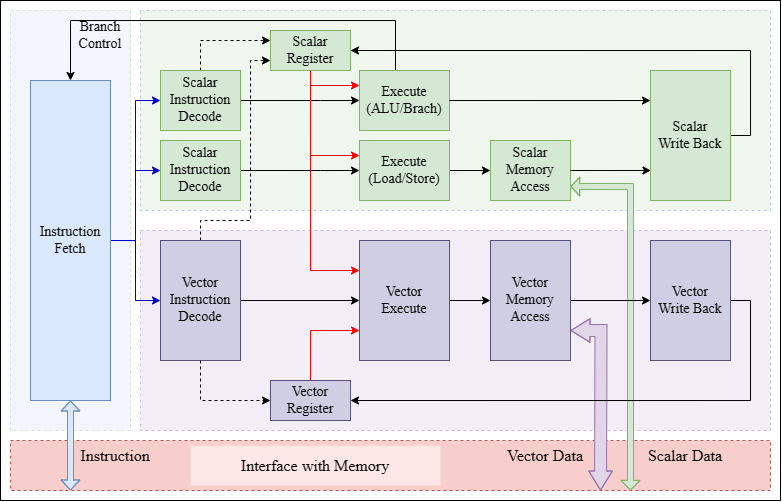

## Background

### Vector Processor

In computer architecture, there are two implementation paths for data parallelism: **MIMD (Multiple Instruction Multiple Data)** and **SIMD (Single Instruction Multiple Data)** . Among the manifestations of MIMD are mainly multi-issue, multi-thread, and multi-core, which can be seen in the contemporary design of processors driven by processing power as the goal. Also, with the rise of applications such as multimedia, big data, and artificial intelligence, it has become increasingly important to endow processors with SIMD processing power. As these applications have a large number of fine-grained, homogeneous, and independent data operations that SIMD is inherently suited to handle. There are three variants of SIMD architecture: vector architecture, SIMD instruction set extensions, and graphics processing units.

The structure of a vector processor fits well with the problem of parallel computation of large amounts of data. A vector processor has multiple ALUs that are capable of performing the same operation many times at the same time. The basic idea of the vector architecture is to collect data elements from memory, put them sequentially into a large set of registers, then operate on them sequentially using a pipelined execution unit, and finally write the result back to memory. **The key feature of vector architecture is a set of vector registers.**

The next picture shows a simplified scalar processor's data flow.

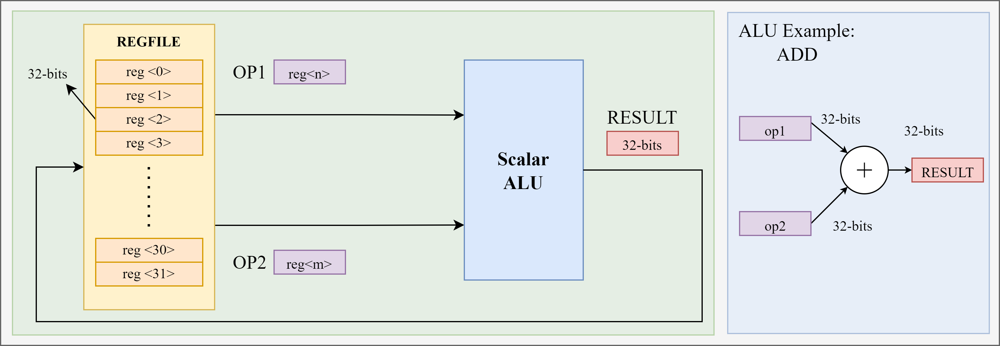

The next picture shows a simplified vector processor's data flow. The scalar operand in scalar architecture is expanded to vector operand in vector architecture. And the relative REGFILE and ALU are expended with vector feature.

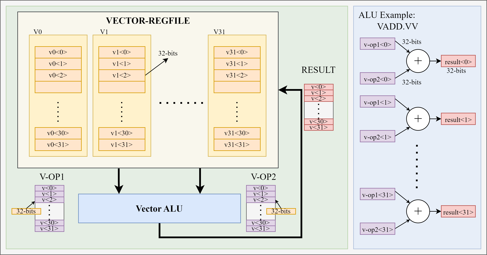

### Vector VS Scalar

In order to visualize the characteristics of vector processors and conventional processors, we provide one case study. We want to use a vector processor and a conventional processor to perform the following operations separately.

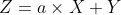

Here X, Y, Z are 8-dimensional vectors, and each element of the vector is one 32-bits integer data; a is a 32-bits integer scalar.

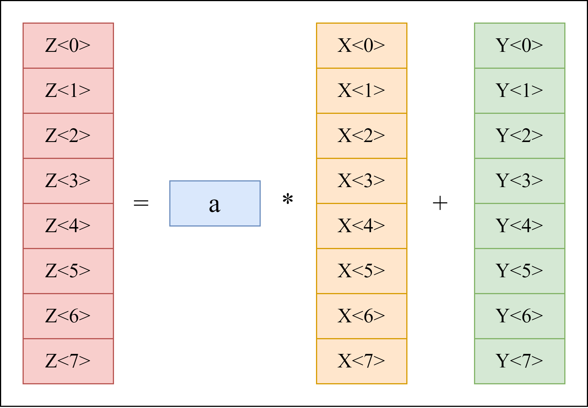

The address of a in memory is in register x4, the base address of X in memory is in register x5, the base address of Y in memory is in register x6, and the base address of Z in memory is in register x7.

| variables                       | a  | X  | Y  | Z  |
| ------------------------------- | -- | -- | -- | -- |
| **base address register** | x4 | x5 | x6 | x7 |

#### Scalar Processor

The assembly code based on the RISC-V instruction set is shown below.

```
    addi    x1,     $zero,  1       ; set x1 = 1
    lw      x11,    0(x4)           ; load scalar a
    addi    x12,    $zero,  8       ; upper bound of what to load
loop:
    lw     x13,    0(x5)           ; load X[i]
    mul     x13,    x13,    x11     ; a x X[i]
    lw      x14,    0(x6)           ; load Y[i]
    add     x14,    x14,    x13     ; a x X[i] + Y[i]
    sw      x14,    0(x7)           ; store Z[i]
    addi    x5,     x5,     4       ; increment index to x
    addi    x6,     x6,     4       ; increment index to y
    addi    x7,     x7,     4       ; increment index to z
    sub     x12,    x12,    x1      ; x12 = x12 - 1
    bne     x12,    $zero,  loop    ; check if done
```

#### Vector Processor

The assembly code based on the RISC-V Vector-Extension instruction set is shown below.

```
lw         x11,    0(x4)          ; load scalar a
vle32.v    v13,    0(x5)          ; load vector X
vmul.vx    v14,    v13,    x11    ; a x X
vle32.v    v15,    0(x6)          ; load vector Y
vadd.vv    v16,    v14,    v15    ; Z = a x X + Y
sle32.v    v16,    0(x7)          ; store Z
```

#### Comparison

By comparing the two assembly code implementations, several interesting points are clearly noticeable.

1. The vector processor greatly reduces the bandwidth requirements for dynamic instructions, and the number of instructions in the vector version of the assembly is much smaller than the number of instructions in the scalar version of the assembly code. This is mainly due to the vector processor's ability to directly compute multiple sets of data in parallel, eliminating the need to use circular instructions.
2. The pipeline blocking frequency is much lower in vector processors than in scalar processors. In scalar processors, each loop must be executed sequentially, lw -> mul -> lw -> add -> sw, and each instruction must wait for the previous instruction to finish, which can easily cause pipeline blocking. As for vector processors, pipeline blocking only occurs once per vector operation and not every time an operation is performed on a vector data element.

### Multi-Issue Processor

In computer architecture, multi-issue techniques enable a processor to issue multiple instructions in a single clock cycle. This technique is divided into two main categories: static multi-issue and dynamic multi-issue.

The execution modes of a dynamic multi-issue pipeline include

1. sequential issue, sequential finish
2. sequential issue, unordered completion
3. sequential issue, sequential completion

As for static multi-issue, it involves static instruction scheduling performed at compile time. Here, the compiler analyzes code, identifies dependencies, and arranges instructions for efficient simultaneous execution during each clock cycle.

> In this lab, we only focus on the `static multi-issue` technique.

Multiple instructions issued in a cycle are viewed as one long instruction with multiple operations. Multiple instructions issued in a cycle are viewed as one long instruction with multiple operations, called a "issue packet".

Static multi-issue was originally known as Very Long Instruction Word (VLIW), and processors using this technique were called VLIW Processors.

The types of instructions that can be issued in the same cycle are limited. (e.g., only one ALU instruction/branch instruction, one Load/Store instruction)

The following figure gives an instruction processing timing diagram for a 2-issue pipelined processor. ALU/Branch instructions and Load/Store instructions can be seen to be processed in parallel at the same time. In order to support this operation, the hardware needs to have separate data paths for each of them.

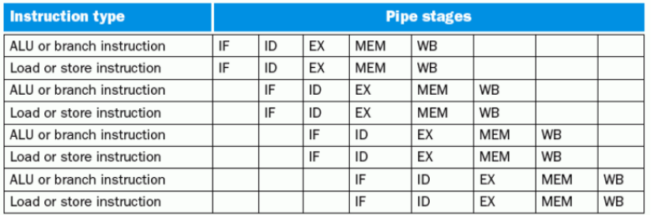

To help understand the concepts, we rewrite the previous assembly code for a single-issue scalar processor as two-issue assembly code. Note that the code representation on the same line is executable in parallel.

```
    addi    x1,     $zero,  1       ; lw      x11,    0(x4)             ; set x1 = 1 & load scalar a
    addi    x12,    $zero,  8       ; nop                               ; upper bound of what to load
loop:
    nop                             ; lw     x13,    0(x5)              ; load X[i]
    mul     x13,    x13,    x11     ; lw      x14,    0(x6)             ; a x X[i] & load Y[i]
    add     x14,    x14,    x13     ; nop                               ; a x X[i] + Y[i]
    addi    x5,     x5,     4       ; sw      x14,    0(x7)             ; increment index to x & store Z[i]
    addi    x6,     x6,     4       ; nop                               ; increment index to y
    addi    x7,     x7,     4       ; nop                               ; increment index to z
    sub     x12,    x12,    x1      ; nop                               ; x12 = x12 - 1
    bne     x12,    $zero,  loop    ; nop                               ; check if done
```

### RISC-V

RISC-V is an open instruction set architecture (ISA) based on the principles of Reduced Instruction Set Computing (RISC), with V denoting the fifth generation of RISC (Reduced Instruction Set Computer), which represents the four previous generations of RISC processor prototype chips. Compared to most instruction sets, the RISC-V instruction set is free to be used for any purpose, allowing anyone to design, manufacture and market RISC-V chips and software.

RISC-V instruction set can be subdivided, including RV32I, RV32M, RV32F, RV32D, RV32A, RV32V etc. The instruction set RV32I is the fixed basic integer instruction set, which is also the core content of RISC-V. And the other instruction sets are different extended sets. RV32V is the set with vector extension. Moreover, you can add the custom instruction set following the instruction format. The first stable release of RISC-V's vector extensions, riscv-v-spec-1.0, was released in September 2021.

In this lab, RV32I, RV32M and RV32V  instruction set are used.

#### RV32I

The following figure shows the six basic instruction formats of RV32I:

1. R-type instructions for register-register operations
2. I-type instructions for short immediate and access load operations
3. S-type instructions for access store operations
4. B-type instructions for conditional jump operations
5. U-type instructions for long immediate
6. J-type instructions for unconditional jumps

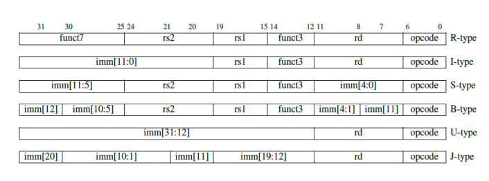

The following figure shows the RV32I opcode mapping with instruction layout, opcode, format type and name.

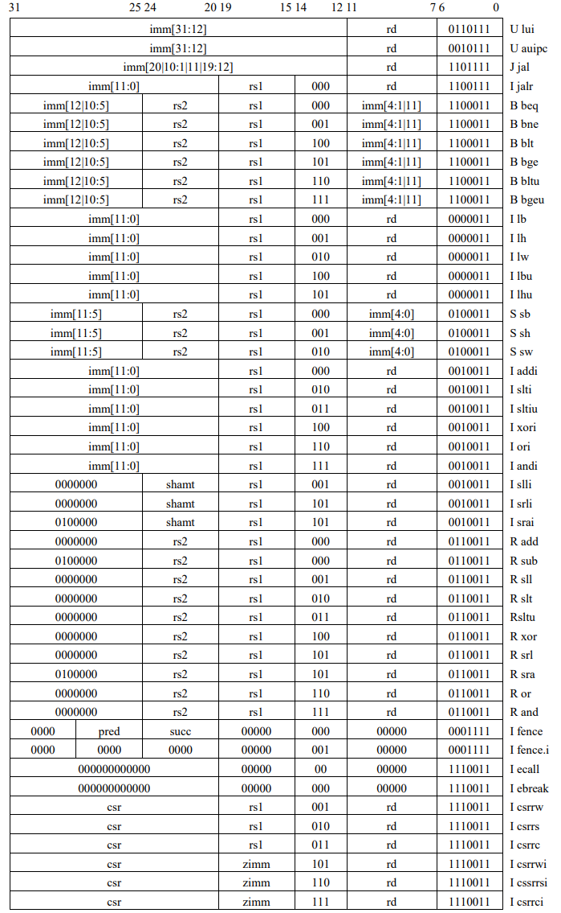

#### RV32M

RV32M adds integer multiplication and division instructions to RV32I.

RV32M has division instructions for signed and unsigned integers: divide(div) and divide unsigned(divu), which put the quotient into the target register. In a few cases, the programmer needs the remainder rather than the quotient, so RV32M provides
remainder(rem) and remainder unsigned(remu), which write the remainder to the target register instead of the quotient.

To correctly obtain a signed or unsigned 64-bit product, RISC-V comes with four multiplication instructions. To get the integer 32-bit product (the lower 32 bits of 64 bits) use the mul instruction. To get the high 32 bits, use the mulh instruction if the operands are all signed, the mulhu instruction if the operands are all unsigned, or the mulhsu instruction if one is signed and one is unsigned.

> In this lab, we only focus on the single instruction `mul`.

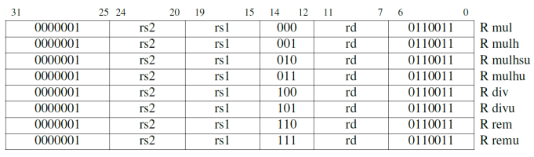

#### RV32V

The instructions in the vector extension fit under two existing major opcodes (LOAD-FP and STORE-FP) and one new major opcode (OP-V).

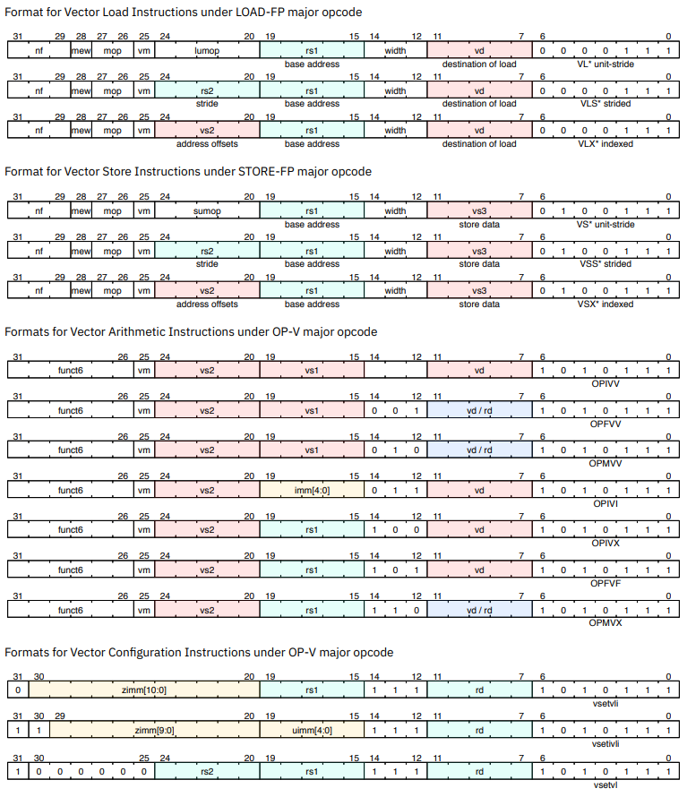

Vector loads and stores are encoded within the scalar floating-point load and store major opcodes (LOAD-FP/STORE-FP). And LOAD-FP and STORE-FP commands will be introduced later in the setup session.

The Vector Configuration Instructions is not of interest to us for this experiment and will not be introduced. We only focus on Vector Arithmetic Instructions. To make it easier to understand the meaning of the OP-V instruction, we have split it into two parts.

| Category | operation                | Operands         | Type of scalar operand                               |
| -------- | ------------------------ | ---------------- | ---------------------------------------------------- |
| OPI-VV   | integer operation        | vector-vector    | N/A                                                  |
| OPF-VV   | floating-point operation | vector-vector    | N/A                                                  |
| OPM-VV   | mask operation           | vector-vector    | N/A                                                  |
| OPI-VI   | integer operation        | vector-immediate | `imm[4:0]`                                         |
| OPI-VX   | integer operation        | vector-scalar    | GPR(general purpose registers)`x` register `rs1` |
| OPI-VF   | integer operation        | vector-scalar    | FP `f` register `rs1`                            |
| OPM-VX   | mask operation           | vector-scalar    | GPR `x` register `rs1`                           |

> In this lab, we only focus on the `OPIVV`, `OPIVI` and `OPIVX`.

## Lab Goals

The purpose of the lab is to design a multi-issue RISC-V processor, which can perform the MAC operation. The expected operation is shown below. The dimensions of all matrices are 8 by 8 and each element of the matrices is 32-bits data. Matrix-A is the weight matrix. Matrix-B is the input matrix. Matrix-C is the bias matrix. Matrix-D is the output matrix.

> Assuming no data overflow will occur.

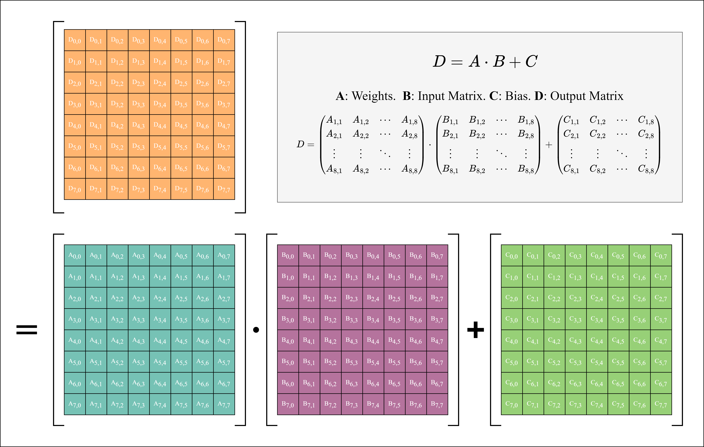

## Lab Setup

### Data Mapping

The mapping of the data of the matrix to the addresses of the memory are shown in the following figures. For all the matrixes involved, we provide two ways of data mapping.

One is to store the matrixes in order.

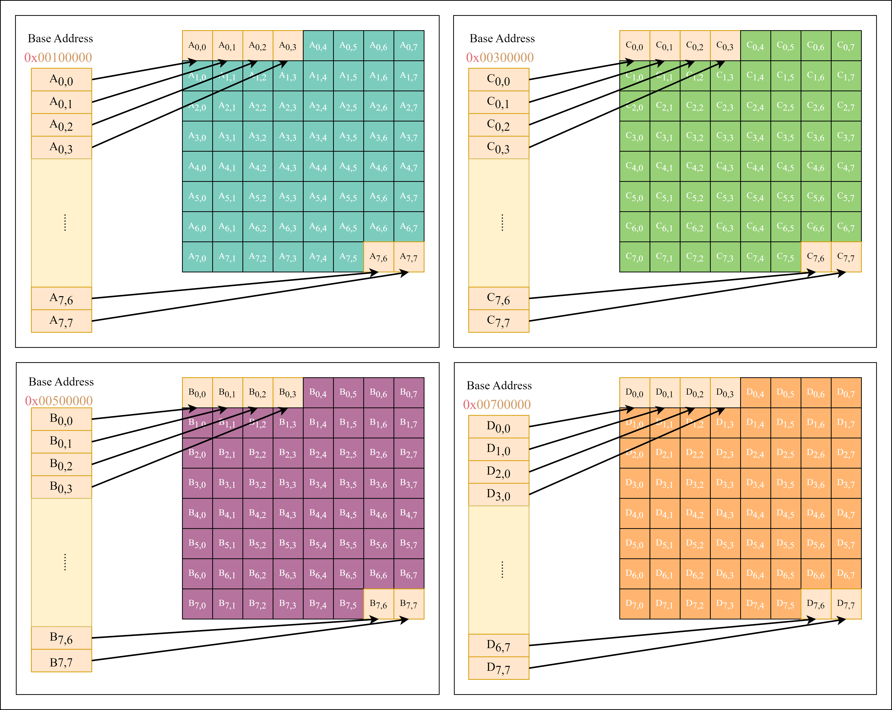

The other is to store the transposed matrixes in order.

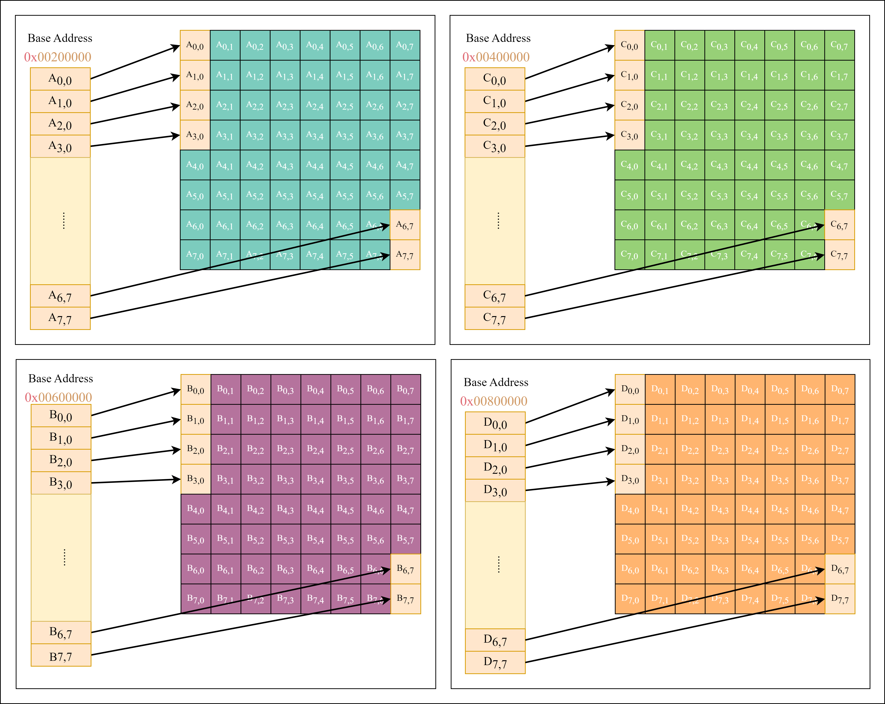

The base address is the first element's address of the data block. The detailed base address information is shown below.

| **Data** | **Base Address** |
| -------------- | ---------------------- |
| Instructions   | 0x80000000             |
| Matrix-A       | 0x80100000             |
| Matrix-A.T     | 0x80200000             |
| Matrix-B       | 0x80300000             |
| Matrix-B.T     | 0x80400000             |
| Matrix-C       | 0x80500000             |
| Matrix-C.T     | 0x80600000             |
| Matrix-D       | 0x80700000             |
| Matrix-D.T     | 0x80800000             |

### Memory Interface

To reduce the challenge of accessing memory, we use 3 simplified memory access models.

> **Caution** : The memory excuse has been greatly simplified here to reduce the difficulty of the experiment. The memory can read out data in one clock cycle (processor clock) during the simulation. But in practice, the memory read and write speed is much lower than the processor's main frequency. In addition, the memory and the processor are often connected through the bus, and instruction storage and data storage do not necessarily use two sets of read-out interfaces, so the processor may also need to arbitrate when reading the memory to decide whether to read the data or the instruction first.

The INST_RAMHelper is used to get the instructions from the memory.

```verilog
module INST_RAMHelper(
  input         clk,
  input         ren,    // read enable 
  input  [31:0] raddr,  // read address
  output [31:0] rdata   // read data
);
```

The SCALAR_RAMHelper is used to get the scalar data from the memory.

```verilog
module SCALAR_RAMHelper(
  input         clk,
  input         ren,    // read enable 
  input  [31:0] raddr,  // read address
  output [31:0] rdata,  // read data
  input         wen,    // write enable 
  input  [31:0] waddr,  // write address
  input  [31:0] wdata,  // write data
  input  [31:0] wmask   // write mask
);
```

The Vector_RAMHelper is used to get the vector data from the memory.

```verilog
module VECTOR_RAMHelper(
  input          clk,
  input          ren,    // read enable 
  input  [31 :0] raddr,  // read address
  output [255:0] rdata,  // read data
  input          wen,    // write enable 
  input  [31 :0] waddr,  // write address
  input  [255:0] wdata,  // write data
  input  [255:0] wmask   // write mask
);
```

### Data Access

The minimum stride of access memory is 1 Byte (8 bits).

**For 32-bits data access, the access address's step is 4.** For example, data A and data B are both 32-bit data and stored in adjacent locations. Data A's address is 0x0000_1000 and data B's address is 0x0000_1004.

### RISC-V Vector Extension

#### Vector Data Width Setting

The vector extended RISCV processor contains 32 vector registers, `x0-x31`.

`VLEN`: represents a fixed bit width for each vector register.

`SEW`: represents the bit width of the selected vector element. It is controlled by register vsew[2:0].

Taking `VLEN=128bits` as an example, the correspondence between the number of elements contained in each vector register and `SEW` is shown in the following table.

| **VELN** | **SEW** | **Elements Per Vector Register** |
| :------------: | :-----------: | :------------------------------------: |
|      128      |      64      |                   2                   |
|      128      |      32      |                   4                   |
|      128      |      16      |                   8                   |
|      128      |       8       |                   16                   |

`LMUL`: represents the vector length multiplier. When greater than 1, it represents the default number of vector registers. Multiple vector registers can be grouped, so a vector instruction can operate on multiple vector registers.

`VLMAX`: represents the maximum number of vector elements that a vector instruction can operate on. `VLMAX=LMUL*VLEN/SEW`.

***!!! IMPORTANT !!!***

**To simplify the experiment, we set all the above parameters to fixed values.**

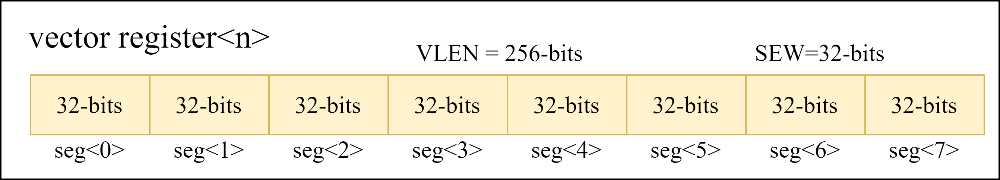

#### Mask Setting

In the arithmetic and access instructions, you can choose whether to use the mask mask or not, and whether to enable the function is controlled by the vm bit in the instruction.

***!!! IMPORTANT !!!***

In this experiment, the mask is not used by default. **And **`vm`** is set to 1 in all instructions to disable the mask function.**

#### Load/Store Setting

There are 3 different access modes for RISC-V vector extensions: **unit-stride, stided, indexed** .

The `unit-stride` operation accesses consecutive elements stored in memory starting at the base effective address.

The `strided` operation accesses the first memory element at the base effective address, and then accesses subsequent elements at the address increment given by the byte offset contained in the x register specified by rs2.

The `indexed` operation adds the vector offset specified by rs2 to the base effective address to obtain the effective address of each element.

The following images describe the format of the access command and its specific meaning.

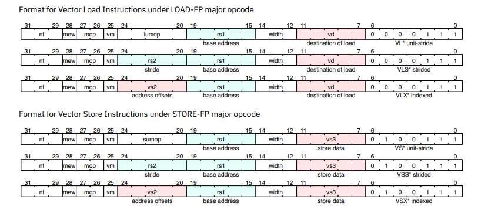

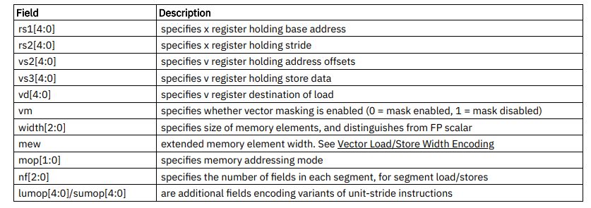

***!!! IMPORTANT !!!***

In order to simplify the experiment, this experiment **only needs to support the access mode of  **`unit-stride`** . In addition, the  **`nf`** ,  **`mew`** ,  **`mop`** , and **`lumop`** bits of the access instruction can be set to the default value of 0.**

### Assembly Code

The assembly code needs to be translated into machine code by the compiler in order to be recognized and executed by the processor. A simple compiler is provided in the experimental environment to compile the assembly code into a bin file. Using this compiler requires the assembly code to be written in the specified format.

If you are not familiar with the assembly code, you can try to use the RISC-V assembler and runtime simulator.

> [TheThirdOne/rars: RARS -- RISC-V Assembler and Runtime Simulator (github.com)](https://github.com/TheThirdOne/rars)

The file `demo.asm` in the asm folder shows an example code that calls all the used instructions in the lab. Please refer to the format of this code to write assembly code.

The scalar registers' names are `x0-x31`. And `x0` can be replaced with `zero`.

The vector registers' names are `vx0-vx31`. And `vx0` can be replaced with `vzero`.

```
; =======================================
; scalar instructions
; =======================================

; load matrix_A base-address 0x80100000 to the register x5 
; ( the immediate number is already shifted 12-bits here )
lui     x5,     2148532224          ; x5 = 0x80100000

addi    x6,     x5,     4           ; x6  = x5+4
lw      x7,     0(x5)               ; x7  = A[0][0]
lw      x8,     4(x6)               ; x18 = A[0][2]

slti    x9,     x7,     64          ; x9 = (x7<64)
addi    x9,     zero,   1           ; x9  = 1 
add     x10,    x9,     x9          ; x10 = x9+x9 
and     x11,    x10,    x9          ; x11 = x10 & x9 
mul     x12,    x10,    x10         ; x12 = x10 * x10 
sll     x13,    x9,     1           ; x13 = x9<<1 

addi    x9,     zero,   4           ; assign 4 to x9
addi    x10,    zero,   0           ; assign 0 to x10 
loop:   
addi    x10,    x10,    1           ; assign x10+1 to x10 
mul     x12,    x12,    x10         ; assign x12*x10 to x12 
blt     x10,    x9,     loop        ; if( x10<x9 ) jump to loop

sw      x12,    0(x5)               ; A[0][0] = x12 
jal     x1,     label               ; jump to label 

; =======================================
; vector instructions
; =======================================
label:
vle32.v vx2,    x5,     1           ; vx2 = A[0][0:7]

vadd.vi vx3,    vzero,  1   ,   1   ; vx3[i] = 1
vadd.vx vx3,    vzero,  x12 ,   1   ; vx3[i] = x12
vmul.vv vx4,    vx2,    vx3 ,   1   ; vx4[i] = vx2[i] * vx3[i]

vse32.v vx4,    x5,     1           ; A[0][0:7] = vx4 


```

## Detailed Tasks

### Task1.1 - Signle-Issue RISCV-32IM

You need to complete multiple instructions in the table below and pass the test. Here `sext` means `signed extended` and `Mem` means `Memory`. The logic operation (`and`) is bit-wise.

> HINT: Finish the code in vsrc/components/single_issue/{`si_inst_decode, si_alu`}.v

| Type | Instruction | Format               | Implementation                          |
| ---- | ----------- | -------------------- | --------------------------------------- |
| R    | mul         | mul rd, rs1, rs2     | x[rd] = x[rs1] * x[rs2]                 |
| R    | add         | add rd, rs1, rs2     | x[rd] = x[rs1] + x[rs2]                 |
| R    | and         | and rd, rs1, rs2     | x[rd] = x[rs1] & x[rs2]                 |
| R    | sll         | sll rd, rs1, rs2     | x[rd] = x[rs1] << x[rs2]                |
| I    | addi        | addi rd, rs1, imm    | x[rd] = x[rs1] + sext(immediate)        |
| I    | slti        | slti rd, rs1, imm    | x[rd] = x[rs1] < sext(immediate)        |
| I    | lw          | lw rd, offset(rs1)   | x[rd] = Mem[x[rs1] + sext(offset)]      |
| S    | sw          | sw rs2, offset(rs1)  | Mem[x[rs1] + sext(offset)] = x[rs2]     |
| B    | blt         | blt rs1, rs2, offset | if (x[rs1] < x[rs2]) pc += sext(offset) |
| U    | lui         | lui rd,imm           | x[rd] = immediate[31:12] << 12          |
| J    | jal         | jal rd,offset        | x[rd] = pc+4; pc += sext(offset)        |

> To better understand the meaning of these instructions, you can refer to [this](https://msyksphinz-self.github.io/riscv-isadoc/html/rvi.html).

> To get the corresponding instruction format, you can refer to [this](#rv32i).

> The code templates have been provided for the implementation of several instructions.

> HINT: Finish the code in /src/vsrc/components/single_issue. The datapath (/src/vsrc/rvcpu/rvcpu_single_issue.v) is already finished.

### Task1.2 - Assembly Code 1

After completing Task 1, we have been able to use these instructions to perform some useful computation. Now, use these instructions to complete the [MAC](#lab-goals) Operation.

> HINT: Finish the code asm/task1_2.asm

### Task2.1 - Two-Issue Processor

Split the datapath of the processor of Task1.1 and reorganize it into a two-issue processor.

> HINT: Finish the code in /src/vsrc/components/two_issue and the datapath file (/src/vsrc/rvcpu/rvcpu_two_issue.v).

### Task2.2 - Assembly Code 2

Rewrite the assembly code of Task 1.2 to adapt it to two-issue processor.

> HINT: Finish the code asm/task2_2.asm

### Task3.1 - Vector Extension

You need to complete multiple instructions in the table below and pass the test.

> HINT: Finish the code in /src/vsrc/components/vector_issue and the datapath file (/src/vsrc/rvcpu/rvcpu_three_issue.v).

| Type  | Instruction | Format                   | Implementation          |
| ----- | ----------- | ------------------------ | ----------------------- |
| LOAD  | vle32.v     | vle32.v vd, rs1, vm      | vd = Mem[x[rs1]]        |
| STORE | vse32.v     | vse32.v vs3, rs1, vm     | Mem[x[rs1]] = vs3       |
| OPIVV | vadd.vv     | vadd.vv vd, vs2, vs1, vm | vd[i] = vs2[i] + vs1[i] |
| OPIVI | vadd.vi     | vadd.vi vd, vs2, imm, vm | vd[i] = vs2[i] + imm    |
| OPIVX | vadd.vx     | vadd.vx vd, vs2, rs1, vm | vd[i] = vs2[i] + x[rs1] |
| OPIVV | vmul.vv     | vmul.vv vd, vs2, vs1, vm | vd[i] = vs2[i] * vs1[i] |
| OPIVI | vmul.vi     | vmul.vi vd, vs2, imm, vm | vd[i] = vs2[i] * imm    |
| OPIVX | vmul.vx     | vmul.vx vd, vs2, rs1, vm | vd[i] = vs2[i] * x[rs1] |

The formats of relative instructions are shown below.

| Instruction | Format                                                                                                                                                                                 |
| ----------- | -------------------------------------------------------------------------------------------------------------------------------------------------------------------------------------- |
| `vle32.v` |                                                                                                                                             |
| `vse32.v` |                                                                                                                                             |
| `vadd.vv` |                                                                                                                                             |
| `vmul.vv` |                                                                                                                                             |
| other       | `vadd.vi`, `vadd.vx`, `vmul.vi`, and `vmul.vx`  only need to modify the `funct3`.<br />For `OPIVI`, the `funct3` is `011`. For `OPIVX`, the `funct3` is `100.` |

> HINT: Finish the code in /src/vsrc/components/vector_issue and the datapath file (/src/vsrc/rvcpu/rvcpu_three_issue.v).

### Task3.2 - Assembly Code 3

Vector processors can handle [MAC](#lab-goals) operations more efficiently. Now, use the vector instruction to do this operation.

HINT: Finish the code asm/task3_2.asm

***Note that you are only allowed to use instructions from the instruction set RV-32I and RV-32V. In other words, you are not allowed to use the `mul` instruction from RV-32M.***

## Simulation Environment

### File Tree

You should modify the verilog in `vsrc` folder and modify the assembly code in `asm` folder. The `vcd` wave file is in `build/hw` folder.

```
|-- build             --Folder containing the simulation files
|-- src
    |-- asm           --Folder containing the assembly codes
    |-- csrc          --Folder containing the cpp files
    |-- vsrc          --Folder containing the verilog codes
|-- tools             --Folder containing the python scripts
|-- Makefile
```

### Make Command

Run the simulation and test. `IMG` is your assembly code name. `TRANSPOSE` determine using D as the result or using D.T as the final result. `ISSUE_NUM` determine the issue number (1 for Task1.x, 2 for Task2.x, 3 for Task3.x).  You can modify the parameter `IMG`, `ISSUE_NUM`, and `TRANSPOSE` in `Makefile` or in command.

```
make run IMG=task1_2 ISSUE_NUM=1
make run IMG=task2_2 ISSUE_NUM=2 TRANSPOSE=true
```

There are 2 ways to clean the built files.

```
make clean # reserve the vcd file
make clear # clean all files in build_test
```

## Grading

The total score (100%) is the sum of code (100%). Besides, you need to finish the content in `answer.sh`.

### Code (100%)

* Task1 (30%)
  * Task1.1 (15%)
  * Task1.2 (15%)
* Task2 (30%)
  * Task2.1 (20%)
  * Task2.2 (10%)
* Task3 (40%)
  * Task3.1 (20%)
  * Task3.2 (20%)

## Submission

Using the make command to export the git log file and pack up tha lab4 folder. You will get the compressed file `lab4.tar.gz` in `ICS/projects`.

```
make pack
```

Please rename `lab4.tar.gz` with a new name `{StudentNumber_StudentName}_EE219_Lab4.zip`, and submit to Blackboard. The file structure should be like this.

```
12345678_张三_EE219_Lab4.tar.gz
```

## Reference Link

[RISC-V 手册 一本开源指令集的指南](http://riscvbook.com/chinese/RISC-V-Reader-Chinese-v2p1.pdf)

[The RISC-V Instruction Set Manual Volume I: Unprivileged ISA](https://riscv.org/wp-content/uploads/2019/12/riscv-spec-20191213.pdf)

[riscv-card](https://github.com/jameslzhu/riscv-card/blob/master/riscv-card.pdf)

[RV32I, RV64I Instructions](https://msyksphinz-self.github.io/riscv-isadoc/html/rvi.html)

[RISCV-V Online Doc](https://github.com/riscv/riscv-v-spec/blob/master/v-spec.adoc)

[RISCV-V Document Pdf](https://github.com/riscv/riscv-v-spec/releases/download/v1.0/riscv-v-spec-1.0.pdf)
